# 掌上校园App
##### 此app为我个人学习阶段的第一个完整项目。
##### 仅供学习参考，不可商用。
##### 纪念自己第一次参加软件大赛。
---
## 1.	系统功能结构图
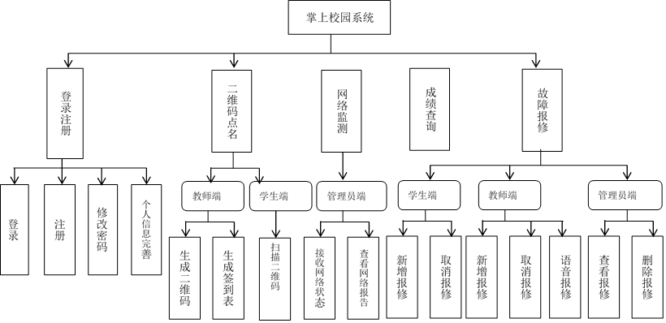
## 2.	模块功能阐述
### 2.1.	登录
#### 用户通过输入账号、密码、身份信息，然后数据库核对密码， 如果密码正确， 则成功登录。 如果密码不正确， 提示错误。功能实现如下：
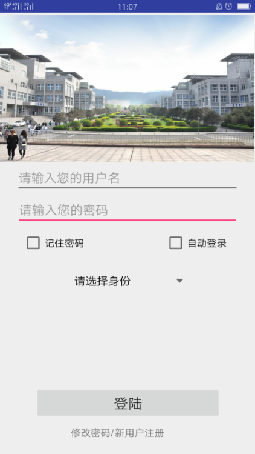
### 2.2.	注册
#### 新用户登录前，进行注册。注册信息包括用户名、密码、身份信息。注册功能实现如下：
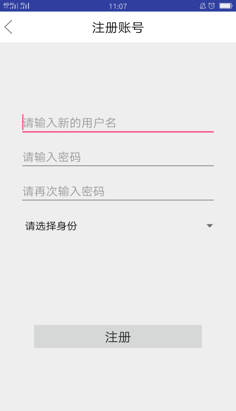
### 2.3.	修改密码
#### 用户登录后，可以修改当前登录账户的密码。修改密码功能实现如下：：
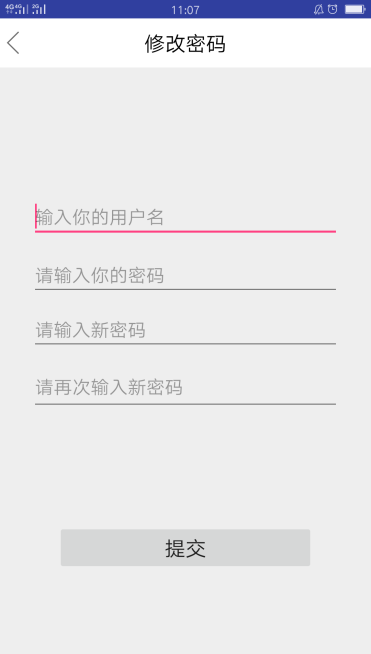
### 2.4.	完善个人信息
#### 登录后，可进一步完善个人信息，包括昵称、手机号等。功能实现如下：
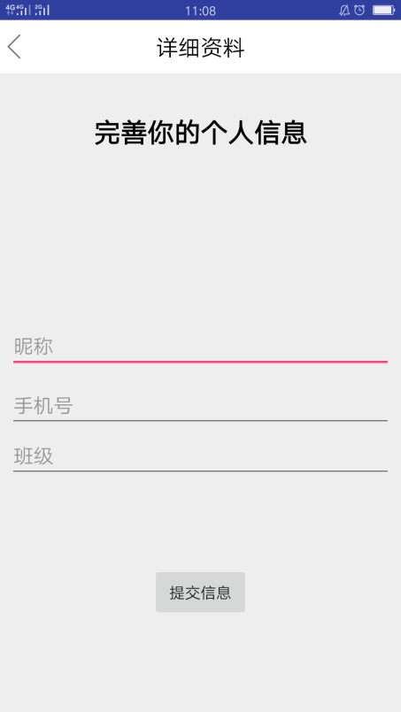
### 2.5.	学生端功能
#### 2.5.1.	故障申报
#### 用户登录后，可上传新的报修信息，需描述故障发生的地点、问题，并可上传故障图片。功能实现如下：
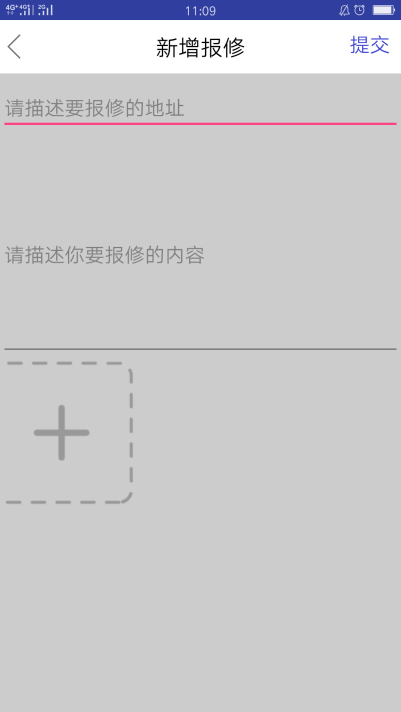
### 2.5.2.	报修信息查看
#### 用户进入系统后，可看到当前所有的报修信息及报修的处理状态—未处理、处理中、已完成，并可在个人中心里看到当前登录用户上传报修信息的处理情况。
#### 功能实现如下：

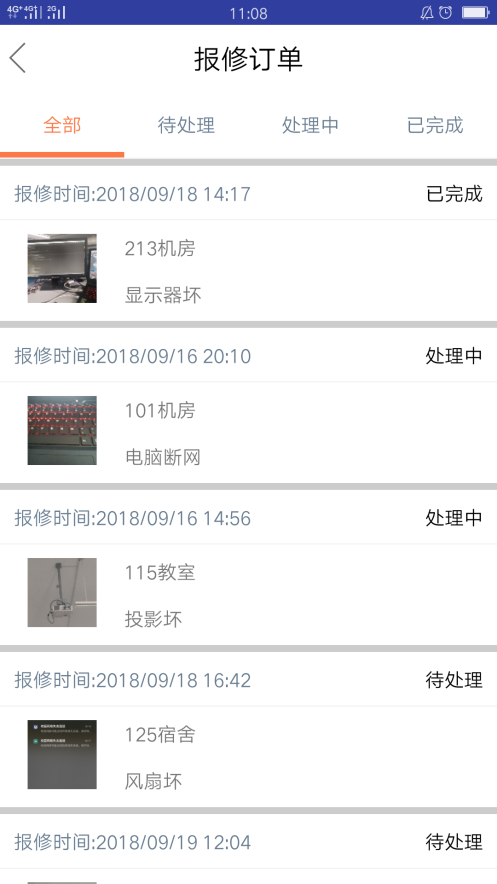
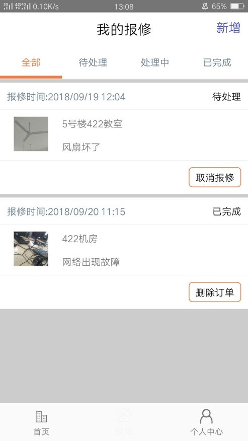
### 2.5.3.	成绩查询
#### 登录后，可应用成绩查询功能。学生可以按学号查询每学期的各科考试成绩。功能实现如下：

### 2.5.4.	扫码签到
#### 学生登录后，应用点名功能可以打开扫描二维码功能，对教师的二维码进行扫描签到。功能实现如下：
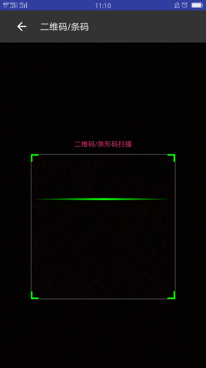
### 2.6.	教师端功能
### 2.6.1.	故障申报
#### 该功能与学生端的故障申报功能相同。
### 2.6.2.	语音报修
#### 以教师身份登录后，进入个人中心，点击“在线语音报修”，可直接语音通知管理员，在管理员的语音提示下排除故障。功能实现如下：
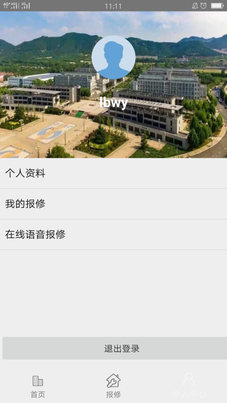
### 2.6.3.	报修信息查看
#### 该功能与学生端的报修信息查看功能相同。
### 2.6.4.	成绩查询
#### 登录后，可应用成绩查询功能。教师可以按教工号查询每学期的所授课程成绩。
### 2.6.5.	生成签到二维码
#### 教师登录后，应用点名功能可以生成班级二维码。学生对教师的二维码进行扫描签到。所有学生扫码签到后，在教师手机端生成班级签到表，即可看到所有学生的出勤情况。功能实现如下：

## 2.7.	管理员端功能
### 2.7.1.	报修信息查看
#### 该功能与学生端的报修信息查看功能相同。
### 2.7.2.	报修信息处理
#### 管理员登录系统后，可接受维修任务，修改维修状态为“处理中”，当完成维修后，可修改维修状态为“已完成”。当用户得到完成报修的反馈信息后，管理员可将该报修信息删除。功能实现如下：

### 2.7.3.	网络动态监测
#### 管理员登录系统后，可实时接收到校园网的运行状态。当网络断开或出现异常时，在管理员手机上可以看到提示及分析报告。功能实现如下：
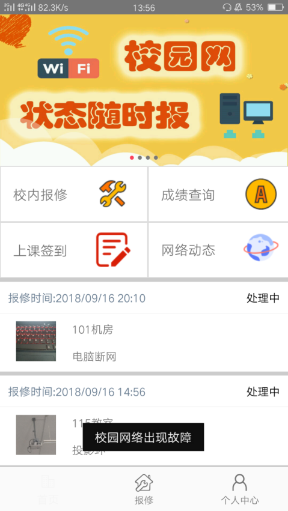
#### designed by JNVC_ShuBoWang
